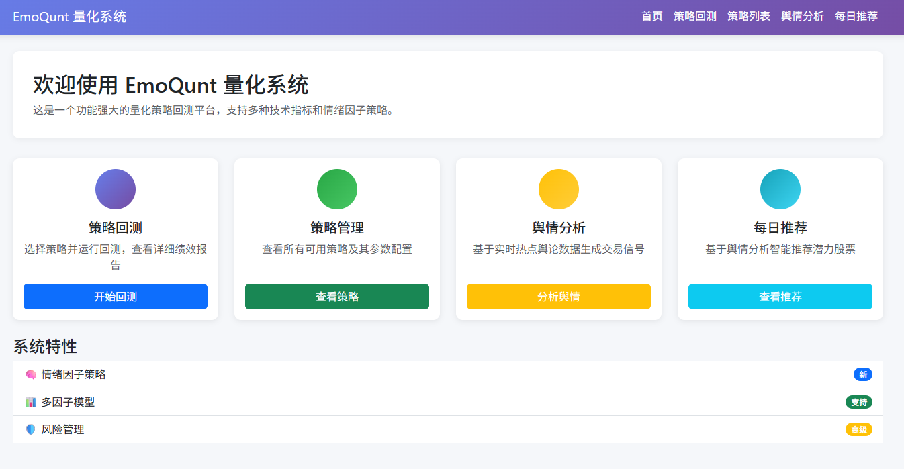
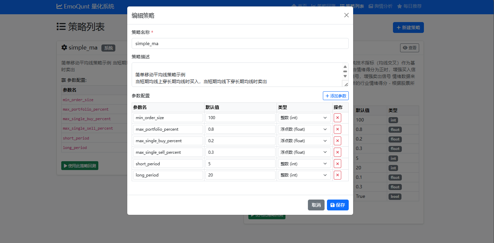
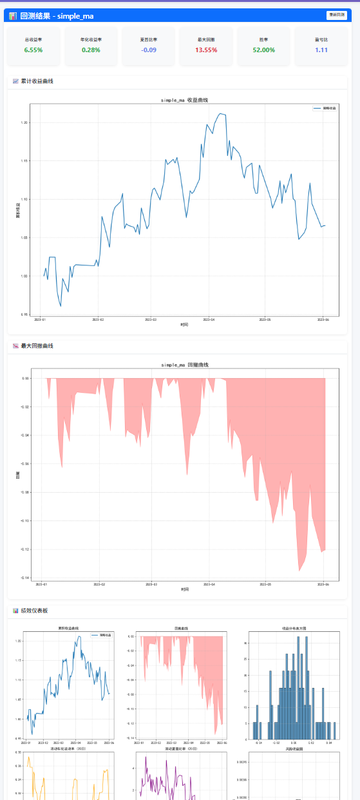
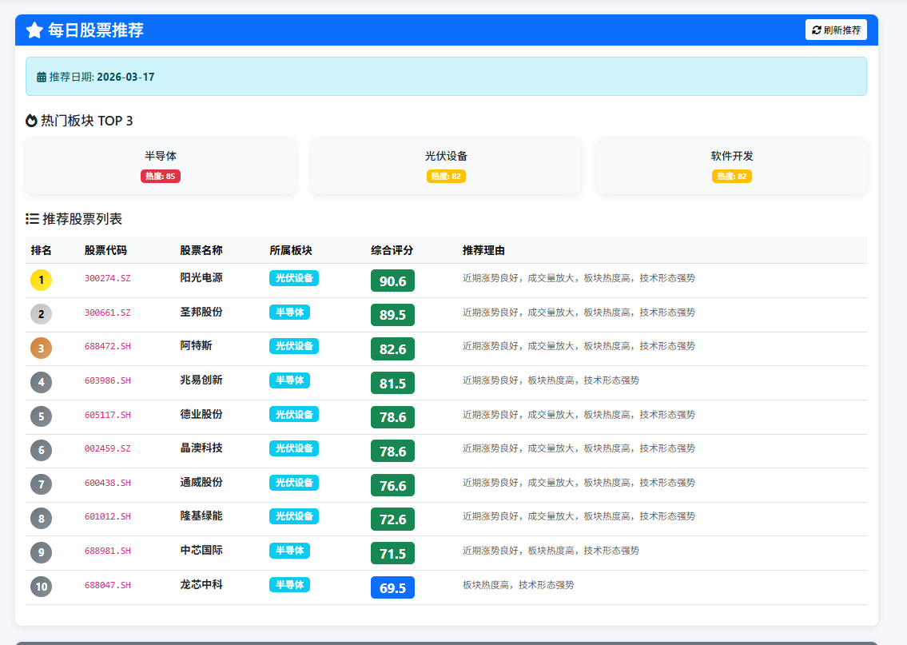
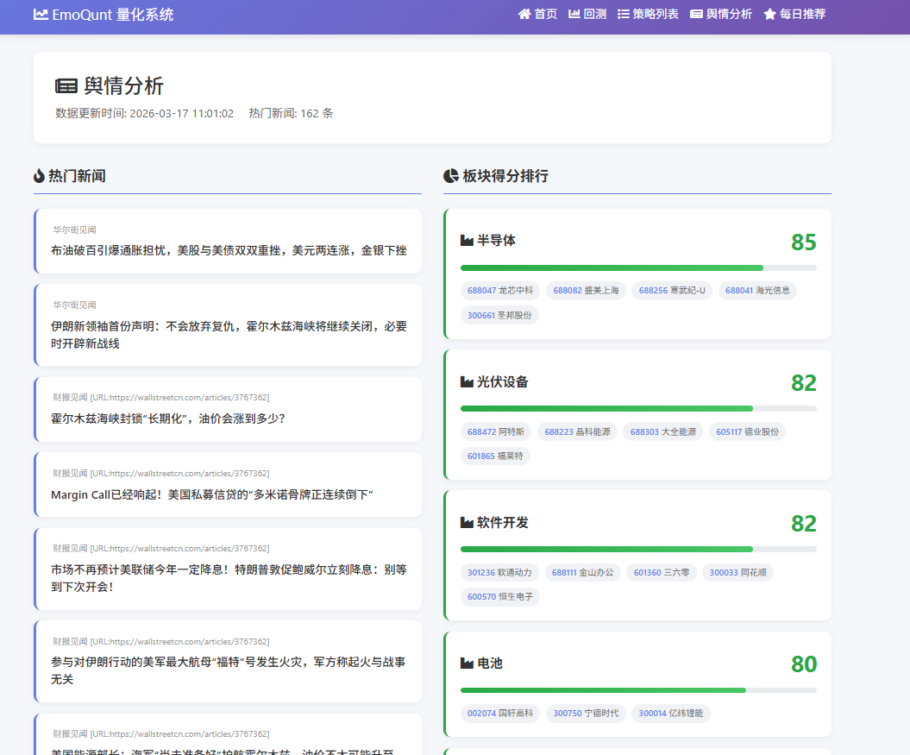

# EmoQunt 量化系统

基于舆情分析的智能量化投资策略回测平台。

## 功能特点

- **策略回测**: 支持多种量化策略的回测分析，包括情绪均线策略等
- **舆情分析**: 基于实时热点舆论数据生成交易信号，分析各板块情绪得分
- **每日推荐**: 智能推荐潜力股票，基于舆情分析结果
- **策略管理**: 创建和管理自定义量化策略，支持从JSON配置文件加载策略
- **缓存机制**: 对策略列表、舆情数据等实现缓存，提高系统响应速度
- **模块化设计**: 代码结构清晰，易于扩展和维护

## 系统架构

```
EmoQunt/
├── config/                 # 配置文件
│   ├── config.yaml         # 主配置文件
│   └── config_loader.py    # 配置加载器
├── logs/                   # 日志文件
├── src/                    # 源代码
│   ├── Strategy/           # 策略模块
│   │   ├── Strategy.py     # 策略基类
│   │   └── __init__.py
│   ├── analysis/           # 分析模块
│   ├── backtest/           # 回测模块
│   ├── data/               # 数据管理
│   ├── factor/             # 因子模块
│   │   ├── sentiment.py    # 情绪因子
│   │   ├── technical.py    # 技术因子
│   │   ├── market.py       # 市场因子
│   │   └── trendradar.py   # 趋势雷达
│   ├── risk/               # 风险管理
│   ├── utils/              # 工具函数
│   └── visualization.py    # 可视化
├── stock_data/             # 股票数据
├── test/                   # 测试文件
├── web/                    # Web应用
│   └── templates/          # HTML模板
├── web_app.py              # 主入口
├── requirements.txt        # 依赖文件
└── README.md               # 项目说明
```

## 页面预览

### 首页


### 策略管理


### 回测结果


### 每日推荐


### 舆情分析


## 快速开始

### 安装依赖

```bash
pip install -r requirements.txt
```

### 启动服务

```bash
python web_app.py
```

访问 http://localhost:8000

## 页面功能

### 1. 首页 (/)
系统概览，展示主要功能入口

### 2. 策略回测 (/backtest)
- 选择股票和策略
- 设置回测参数
- 查看回测绩效和图表

### 3. 策略列表 (/strategies)
- 查看所有可用策略
- 创建新策略（基于固定参数模板）
- 编辑/删除自定义策略

### 4. 舆情分析 (/sentiment)
- 展示当天热门新闻
- 显示各板块舆情得分（前10名）
- 情绪趋势可视化

### 5. 每日推荐 (/daily_recommend)
- 基于舆情分析推荐股票
- 显示推荐理由和评分

## API 接口

| 接口 | 方法 | 说明 |
|------|------|------|
| `/api/strategies` | GET | 获取策略列表 |
| `/api/strategies/detail/{name}` | GET | 获取策略详情 |
| `/api/strategies` | POST | 创建新策略 |
| `/api/strategies/{name}` | PUT | 更新策略 |
| `/api/strategies/{name}` | DELETE | 删除策略 |
| `/api/sentiment` | GET | 获取舆情分析结果 |

## 技术栈

- **后端**: FastAPI
- **前端**: Bootstrap 5 + Jinja2
- **数据**: baostock (A股数据)
- **分析**: pandas, numpy, backtrader
- **可视化**: matplotlib

## 配置

配置文件位于 `config/config.yaml`，包含系统各项配置参数。

## 策略管理

用户可以通过 `src/Strategy/user_strategies/strategies.json` 文件定义自定义策略，基于固定的参数模板进行配置。

## 注意事项

- 确保股票数据文件已正确配置
- 舆情分析需要有效的API Key
- 首次运行时，系统会自动生成必要的目录结构
- 缓存文件位于 `nes_data` 目录，可根据需要手动清理

## 贡献指南

请参考 [CONTRIBUTING.md](CONTRIBUTING.md) 文件。

## 许可证

本项目采用 [MIT](LICENSE) 许可证。
