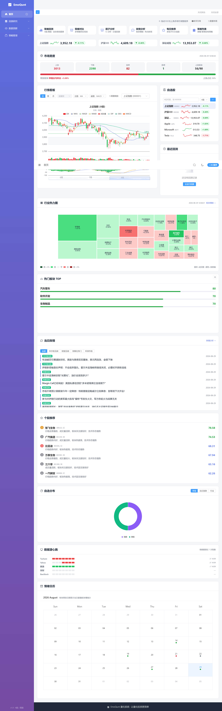
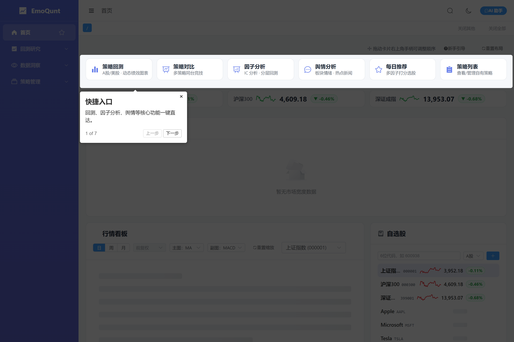
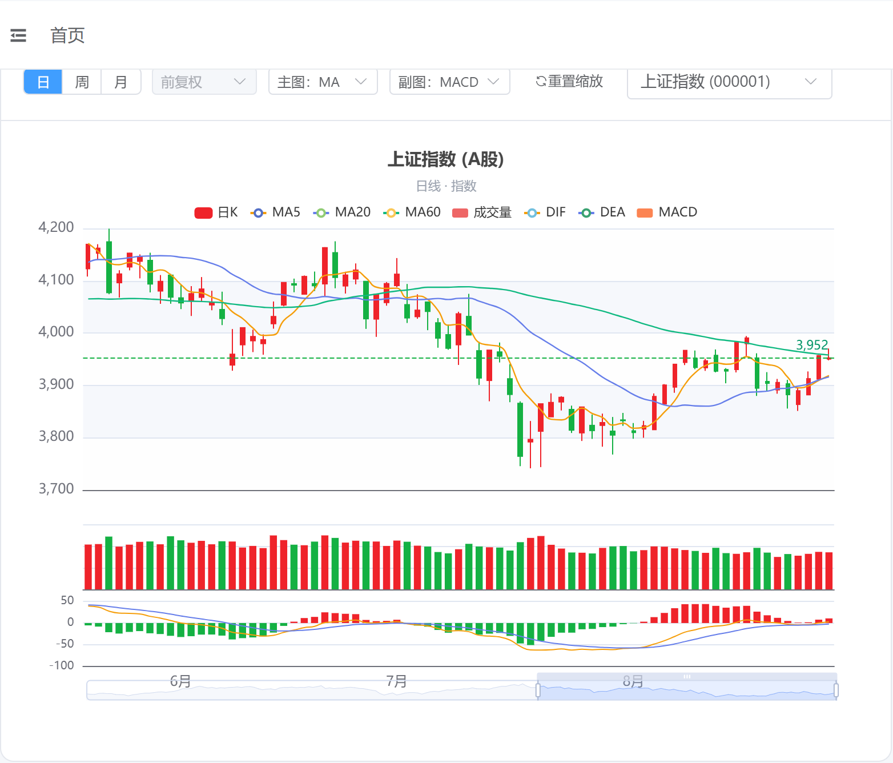
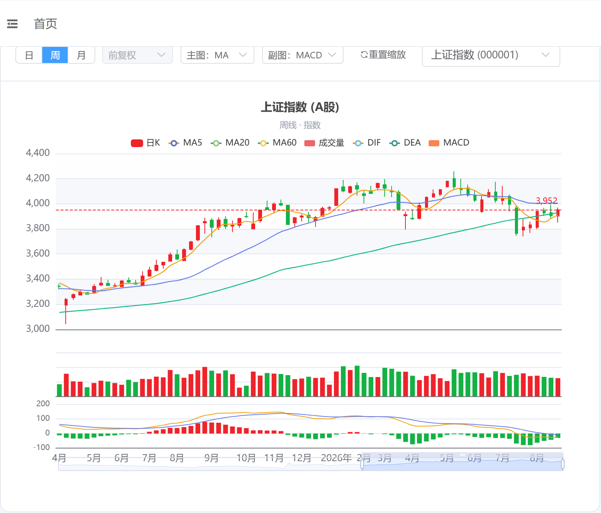
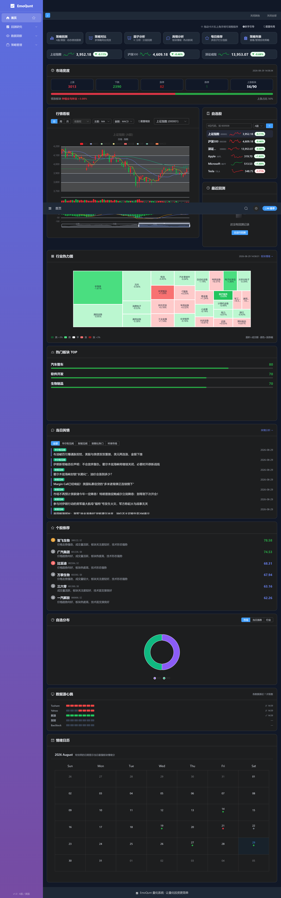
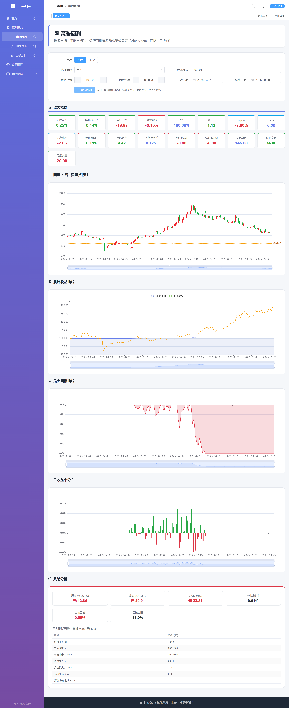
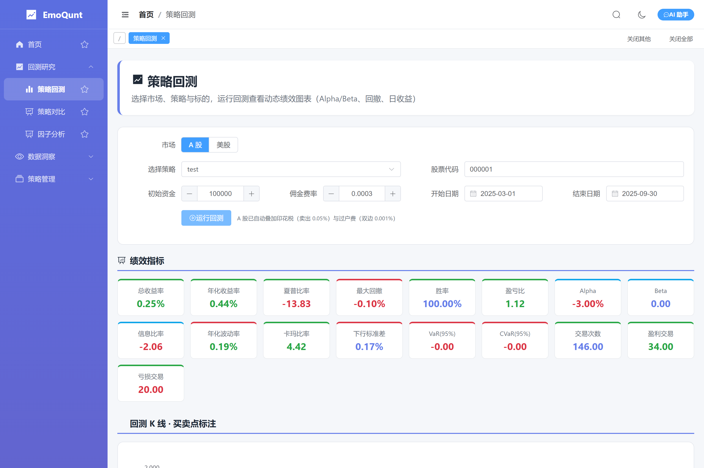
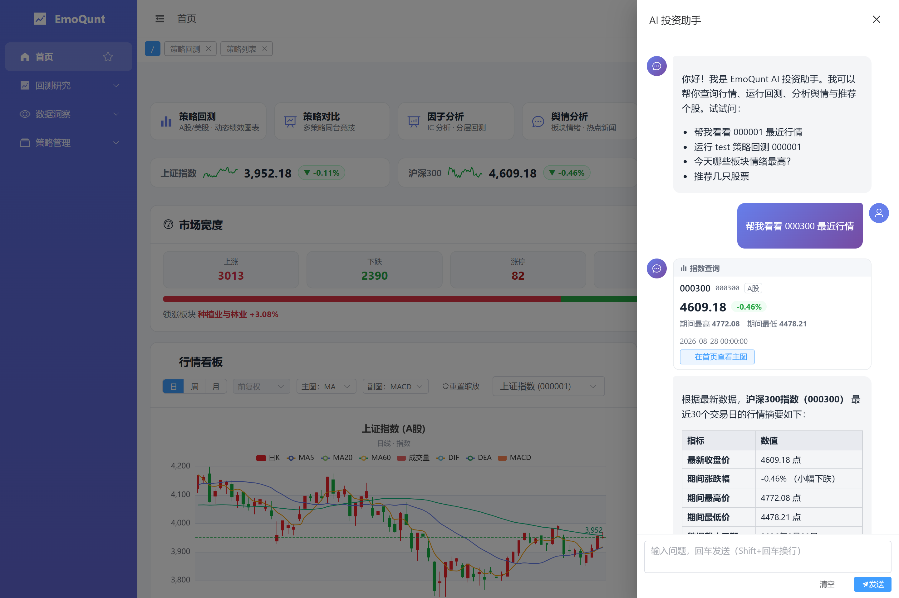
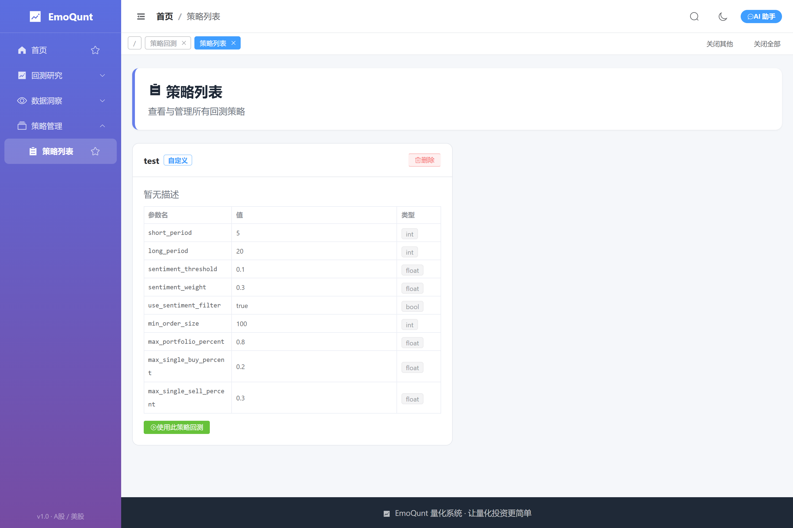
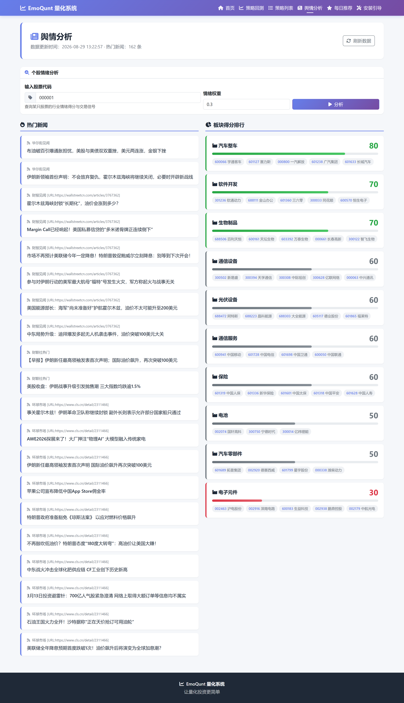

# EmoQunt 量化系统

> [English](README_EN.md) | 中文

基于舆情分析的智能量化投资策略回测平台，支持 **A 股与美股双市场**。融合行业情绪因子、真实交易成本与基准对比，提供从策略构建、回测、因子分析到绩效与风险管理的一站式 Web 体验；配备 **Vue3 现代化 SPA** 与 Jinja2 经典版双前端。

## 功能特点

### 回测引擎
- **双市场成本模型**：A股 `AShareCommInfo`（佣金双边含最低 5 元、印花税仅卖出 0.05%、过户费双边 0.001%）与美股 `USStockCommInfo`（对称佣金、无印花税），按 `market` 参数自动路由
- **基准与风险调整收益**：A股自动获取沪深300、美股获取标普500 作为基准，计算 Alpha / Beta / 信息比率并绘制对比曲线
- **情绪过滤策略**：均线交叉信号可由历史情绪快照过滤（"截至当日最近快照"，避免未来函数）
- **交易级胜率**：胜率按已平仓交易（tradeanalyzer.won/lost）计算
- **绩效与风险分析**：总/年化收益率、夏普、最大回撤、卡玛比率、VaR/CVaR、下行标准差、压力测试场景

### 数据层（多源容错）
- **A股回退链**：Tushare Pro（可选，需 `TUSHARE_TOKEN`）→ akshare 新浪源 → 东财源 → baostock，任一环节失败自动降级
- **美股两级回退**：yfinance（主）→ akshare 新浪源
- **可选 PostgreSQL + Redis 缓存**（`docker-compose.yml` 一键启动，国内源 `docker.m.daocloud.io`，可选 `REDIS_PASSWORD`）：Redis 热缓存 + PG 持久化，读序 Redis → PG → CSV → 网络；不可用时自动静默降级为纯网络模式；PG 支持可选 `psycopg_pool` 连接池与 TTL 分层（当日 300s / 历史 7d±jitter）
- 行情结果缓存至本地 `stock_data/`；情绪快照位于 `nes_data/sentiment_results/{YYYYMMDD}.json`，并通过 `GET /api/sentiment/calendar` 供首页情绪日历使用（纯本地读取，线程池化，不阻塞事件循环）
- **数据源健康心跳**：每个取数层在真实发起处记录成败（`GET /api/data/source-health`，进程内存态、每源近 7 次），渲染为首页心跳条，直观解释"为何某股无数据"

### Vue3 SPA（`/spa/*`，现代化前端）
- **可折叠分组侧边栏导航**（总览 / 回测研究 / 数据洞察 / 策略管理）+ 面包屑 + **暗色模式**（Element Plus `html.dark` 方案）+ **全局命令面板 `Cmd+K`** + **顶部标签页 Tabs** + **侧边栏收藏** + **首访导览**（driver.js 七步引导，看过不再弹、可随时重放）
- **丰富首页**：功能快捷入口、大盘指数速览条（行内 sparkline，点击切换主图）、**自选股面板**（增删、行内 sparkline、最新价数字滚动与涨跌方向闪烁，A股红涨绿跌·美股绿涨红跌，点击切换主图）、**最近回测**（摘要 + 一键重跑参数回填）、热门板块 / 当日舆情（**快讯来源分组过滤** + 来源徽标）/ 个股推荐（点击下钻主图）、**自选分布环图**（市场/当日涨跌/行业三维切换）、**数据源健康心跳条**（各取数源近 7 次成败可视化）、**情绪日历**（`sentiment_results/{YYYYMMDD}.json` 驱动）与 **可拖拽网格布局**（`emoqunt:homeLayout` 持久化）；行情经 **SWR 式轮询**刷新（页面不可见暂停、失败指数退避）
- **动态 ECharts 图表**：回测收益/回撤/日收益曲线（可缩放）；K 线蜡烛图 + 成交量 + MA/BOLL 叠加 + MACD/KDJ/RSI 副图 + 最新价虚线 + 吸顶固定数值面板 + 月边界刻度；**回测 K 线买卖点标注**（后端 `trades` 透传，B/S 箭头 + 加权成本均价线，K 线区间对齐回测日期）
- **SPA 独有页面**：策略对比（2~5 策略同台净值对比 + 指标表）、因子分析（IC 序列 / 分层累计收益 / 单调性检验）
- **浏览器本地持久化**（零依赖 Pinia 插件，`emoqunt:` 前缀 localStorage）：UI 偏好（主题/侧边栏/导览标记）、自选股、回测历史与上次表单、AI 对话记录、收藏/标签页/首页布局——刷新全部保持
- **AI 投资助手**：全局抽屉式对话面板，LangGraph ReAct agent，SSE 流式输出、Markdown 渲染、工具调用过程可见，**工具结果卡片化**（Generative UI：行情/指数/舆情/推荐/回测/信号六类结构化卡片 + 查询中骨架，一键跳转首页主图或对应页面）

### Jinja2 经典版（`/`，服务端渲染）
- **统一设计系统**：`base.html` + `app.css` 设计令牌，Bootstrap 5.3 + Font Awesome 6
- **8 个页面**：首页、策略回测（表单+结果）、策略管理（创建/编辑/删除，SPA 端暂为只读）、舆情分析（含个股入口）、每日推荐、错误页
- 回测表单自动**记忆上次输入**（localStorage；URL 预选参数优先）

### 其它
- **舆情分析**：基于 TrendRadar 实时热点生成板块情绪得分与个股交易信号
- **每日推荐**：融合情绪与多因子模型（涨跌幅/量能/舆情/技术形态）智能推荐
- **策略管理**：基于 JSON 配置动态创建策略，支持模板参数编辑
- **测试覆盖**：pytest 覆盖成本模型、参数解析、绩效指标、Alpha/Beta、数据源、策略管理、通知格式化等（400+ 用例）

## 系统架构

```
EmoQunt/
├── config/                 # 配置文件（config.yaml + 环境变量 QDT_ 前缀覆盖）
├── docs/
│   ├── research/           # UI 调研与决策记录
│   └── screenshots/        # README 截图与采集脚本
├── frontend/               # Vue3 SPA（Vite + TS + Element Plus + ECharts + Pinia）
│   └── src/
│       ├── views/          # 首页/回测/策略列表/舆情/推荐/策略对比/因子分析
│       ├── stores/         # Pinia 状态（chat/ui/watchlist/backtestHistory/favorites/tabs/homeLayout + persist 插件）
│       ├── api/            # axios 封装 + SSE 解析 + 类型定义
│       ├── components/     # CommandPalette/AppTabs/SentimentCalendar/ChatPanel 等
│       └── layouts/        # 侧边栏（含收藏）+ 面包屑 + 标签页 + 暗色/命令面板布局
├── nes_data/               # 舆情数据与情绪快照（sentiment_results/{YYYYMMDD}.json，供首页情绪日历与回测情绪过滤）
├── src/
│   ├── agent/              # LangGraph ReAct 投资助手
│   ├── Strategy/           # 策略基类 + 动态策略工厂 + 情绪过滤 + 用户策略
│   ├── analysis/           # 因子分析（IC / 分层 / 单调性）
│   ├── backtest/           # 回测引擎 + 绩效分析器 + 成本模型
│   ├── data/               # 数据管理：多源回退链 + db.py(PG/Redis 缓存) + 列名契约
│   ├── factor/             # 情绪/技术/市场因子 + 每日推荐
│   ├── risk/               # 风险管理（仓位/止损/VaR/压力测试）
│   ├── services/           # 业务编排薄层（路由适配器与领域模块之间）
│   └── utils/              # 路径/日志/校验/环境变量
├── test/                   # pytest 测试套件
├── web/                    # Jinja2 经典版前端（templates + static）
├── docker-compose.yml      # 可选：PostgreSQL 16 + Redis 7 缓存层
└── web_app.py              # 主入口（FastAPI，双前端 + 统一 /api）
```

## 页面预览

> 截图由 `conda run -n qdt python docs/screenshots/_capture.py` 在本机源码服务（`web_app.py` + `db/cache`）上自动采集，均为 2026-08 第四轮迭代后界面（含首访导览、AI 工具结果卡片、回测买卖点标注、自选分布环图、数据源心跳与快讯来源分组）。

### SPA 首页（亮色）——10 张可拖拽卡片：快捷入口 / 指数速览（sparkline）/ 市场宽度 / 行情看板 / 行业热力图 / 热门板块 / 快讯来源分组 / 个股推荐 / 自选分布环图 / 数据源心跳 + 情绪日历


### 首访导览——driver.js 七步引导（看过不再弹，工具栏可重放）


### SPA K 线看板——红涨绿跌蜡烛 + MA/BOLL 叠加 + 最新价虚线 + MACD/KDJ/RSI 副图 + 日/周/月与复权切换 + 月边界刻度


### SPA K 线周线——服务端聚合，三窗格联动缩放


### SPA 首页（暗色模式）——主题切换后刷新仍保持


### SPA 回测结果——绩效指标 + 回测 K 线买卖点标注 + 动态收益/回撤/日收益图表 + 风险分析


### 回测 K 线 · 买卖点标注特写——B/S 箭头按市场约定配色 + 加权成本均价线，K 线区间与回测日期对齐


### AI 工具结果卡片——Generative UI：行情摘要卡片 + 一键"在首页查看主图"


### SPA 策略列表


### 经典版舆情分析（Jinja2，`/sentiment`）


## 快速开始

### 环境要求
- Python 3.11+（推荐 conda 环境）+ Node.js 18+（仅 SPA 构建需要）
- 网络访问（akshare 行情数据、TrendRadar 舆情、LLM API）

### 安装依赖
```bash
pip install -r requirements.txt
cd frontend && npm install && npm run build   # 构建SPA（未构建时 /spa/* 返回 503）
```

### 配置
1. 复制 `.env.example` → `.env`，填入 LLM `API_KEY` / `LLM_MODEL` / `LLM_BASE_URL`（AI 助手与情绪分析需要）；可选 `TUSHARE_TOKEN` 启用 Tushare 首选数据源
2. 编辑 `config/config.yaml` 调整回测/风险参数

### 启动服务
```bash
python web_app.py            # http://127.0.0.1:8000
```
- 经典版前端：http://localhost:8000/
- **Vue3 SPA**：http://localhost:8000/spa/
- SPA 前端开发模式：`cd frontend && npm run dev` 后访问 http://localhost:5173/spa/（`/api` 自动代理到 8000）

### 可选：启用数据库缓存层
```bash
docker compose up -d         # PostgreSQL 16 + Redis 7（国内源 docker.m.daocloud.io）；连接参数见 .env
# 国内网络：基础镜像与 pip 均已配置国内源；构建镜像时可用 --build-arg PIP_INDEX_URL 覆盖
```

### 运行测试
```bash
pytest test/test_backtest.py -v
```

## 页面功能

**Vue3 SPA（`/spa/*`）**

| 路由 | 功能 |
|------|------|
| `/spa/` | 首页看板：快捷入口、指数速览、自选股、K线主图、最近回测、板块/舆情/推荐 |
| `/spa/backtest` | 策略回测（表单记忆 + 动态图表 + 风险分析；支持 `?historyId=` 回填历史参数） |
| `/spa/strategies` | 策略列表（查看/删除） |
| `/spa/sentiment` | 舆情分析（新闻 + 板块得分） |
| `/spa/daily-recommend` | 每日推荐 |
| `/spa/strategy-compare` | 多策略对比（2~5 个策略净值叠加 + 指标表） |
| `/spa/factor-analysis` | 因子分析（IC / 分层回测 / 单调性） |

**经典版（Jinja2）**

| 路由 | 功能 |
|------|------|
| `/` | 首页，功能入口与系统特性 |
| `/backtest` | 策略回测表单（支持 `?strategy_name=` 预选；记忆上次输入） |
| `/run_backtest` | 回测结果（绩效指标卡 + 收益/回撤/仪表板图表） |
| `/strategies` | 策略列表，创建/编辑/删除自定义策略 |
| `/sentiment` | 舆情分析（热门新闻 + 板块得分 + 个股分析入口） |
| `/analyze_sentiment` | 个股情绪结果（信号、得分、情绪分布图） |
| `/daily_recommend` | 每日推荐（Top3 板块 + 排名股票表） |

## API 接口

两个前端共用同一组 `/api/*` 接口（数据类接口经线程池执行，慢速数据源不会阻塞其它请求）。

| 接口 | 方法 | 说明 |
|------|------|------|
| `/api/health` | GET | 健康检查（含 PG/Redis 缓存层连通性） |
| `/api/strategies` / `list` / `detail/{name}` / `templates` | GET | 策略查询 |
| `/api/strategies/create_new` / `create_from_template` | POST | 创建策略 |
| `/api/strategies/{name}` | PUT / DELETE | 更新 / 删除策略 |
| `/api/backtest/run` | POST | 运行回测，返回 JSON 时序（供 ECharts） |
| `/api/strategies/compare` | POST | 多策略对比 |
| `/api/factor/analyze` | POST | 因子 IC / 分层分析 |
| `/api/kline` | GET | K 线 OHLCV（`stock_code` / `market` / `days`） |
| `/api/sentiment` / `sentiment/data` | GET | 舆情数据 |
| `/api/sentiment/calendar` | GET | 情绪日历（扫描本地 `sentiment_results/*.json`，供首页日历使用） |
| `/api/daily-recommend`（`/refresh`） | GET | 每日推荐（强制刷新） |
| `/api/agent/chat` | POST | AI 助手（SSE 流式） |
| `/api/agent/chat/sync` | POST | AI 助手（非流式） |

## 回测引擎要点

### 交易成本
- **A股**（`AShareCommInfo`）：佣金双边（默认万三，单笔最低 5 元）、印花税**仅卖出** 0.05%、过户费双边 0.001%、可配置滑点（默认 0.05%）
- **美股**（`USStockCommInfo`）：对称佣金，无印花税/过户费

### 基准与风险调整收益
- 按市场自动获取基准（A股=沪深300，美股=标普500）
- 计算 Alpha / Beta（协方差法）、信息比率，图表中绘制基准对比曲线

### 情绪过滤
- 扫描 `nes_data/sentiment_results/*.json` 历史快照，构建"快照日期 × 行业"情绪面板
- 回测中某日仅使用"截至该日最近的历史快照"，**避免未来函数**
- `use_sentiment_filter=True` 时，金叉买入需行业情绪 ≥ −threshold，死叉卖出需 ≤ threshold

## 技术栈

- **后端**：FastAPI + Uvicorn + Jinja2；数据类接口线程池化；可选 `psycopg_pool` 连接池 + 数据缓存层
- **SPA 前端**：Vue 3 + TypeScript + Vite + Element Plus + ECharts + Pinia（含自研 localStorage 持久化插件，含首页可拖拽网格与持久化布局）
- **经典版前端**：Bootstrap 5.3 + Font Awesome 6
- **数据**：akshare / Tushare Pro（可选）/ baostock / yfinance；可选 PostgreSQL 16 + Redis 7 缓存
- **回测**：backtrader + 自定义双市场成本模型
- **分析**：pandas, numpy, scipy, scikit-learn
- **可视化**：ECharts（SPA）、matplotlib / seaborn / plotly（服务端）
- **AI**：OpenAI 兼容 LLM + LangChain + LangGraph（ReAct agent）
- **测试**：pytest

## 配置

配置文件位于 `config/config.yaml`（环境变量 `QDT_` 前缀可覆盖），包含：
- `backtest`：初始资金、佣金费率、滑点开关与费率
- `risk_management`：最大日亏、最大回撤、杠杆、持仓/行业暴露限制
- `data` / `strategy` / `factor` 等其它模块参数

## 策略管理

用户可通过 Web 界面或直接编辑 `src/Strategy/user_strategies/strategies.json` 创建自定义策略，基于 `sentiment_ma`（情绪均线）模板配置参数。

## 注意事项

- 回测首次获取行情/指数数据需联网（结果会缓存；外部数据源偶发不稳时回退链自动切换）
- 舆情分析需要有效的 LLM API Key
- 首次运行时系统会自动生成 `logs/`、`output/`、`nes_data/` 等目录
- SPA 未构建（`frontend/dist` 不存在）时 `/spa/*` 返回 503 提示
- 回测结果仅供参考，不构成投资建议

## 贡献指南

请参考 [CONTRIBUTING.md](CONTRIBUTING.md) 文件。

## 许可证

本项目采用 [MIT](LICENSE) 许可证。
